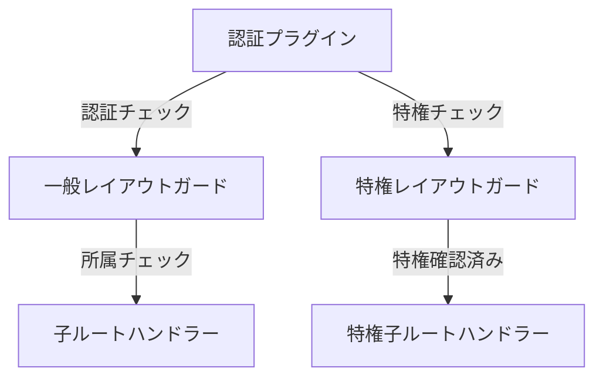

# アクセス制御実装パターン

設計原則・制約は [access-control.md](access-control.md) を参照。

---

## DI 登録

```ts
.registerTransient(
  'AuthorizationService',
  r => new ConcreteAuthorizationService(
    r.resolve('RelationshipResolver'),
    r.resolve('UserRepository'),
  ),
)
```

---

## メソッド呼び出し例

### 判定メソッド (boolean 返却)

```ts
const isMember = await authorizationService.isMemberOf(userId, resourceId);
```

### アサートメソッド (void 返却、失敗時エラーをスロー)

```ts
await authorizationService.assertOwnership(userId, resource.ownerId);
```

---

## UseCase 認可のコード例

```ts
public async execute(input: {Name}Input): Promise<void> {
  const resource = await this.resourceRepository.findById(input.resourceId);
  this.authorizationService.assertOwnership(input.userId, resource.ownerId);

  await this.resourceRepository.delete(resource.id);
}
```

### `@throws` JSDoc のコード例

```ts
/**
 * @throws {AccessDeniedError} 所有者でない場合
 */
public async execute(input: {Name}Input): Promise<void> {
  // ...
}
```

---

## ルートガードのコード例

### 階層構造



### 親ガード結果の共有

```ts
// 親レイアウトガード
requestEvent.sharedMap.set(GUARD_RESULT_KEY, { user, membership });

// 子ルートのハンドラー
const { user } = requireSharedMapValue(requestEvent.sharedMap, GUARD_RESULT_KEY);
```

### ルートアクションでの認可エラーハンドリング

`routeAction$` 等のミューテーションハンドラーで UseCase から `AccessDeniedError` がスローされた場合、403 レスポンスに変換する。

```ts
// .server.ts
export async function deleteResourceHandler(
	data: { resourceId: string },
	requestEvent: RequestEventAction,
): Promise<ReturnType<RequestEventAction['fail']> | undefined> {
	const { user } = requireSharedMapValue(requestEvent.sharedMap, GUARD_RESULT_KEY);

	const container = await useContainer(requestEvent.platform.env);
	const useCase = container.resolve('Delete{Name}UseCase');
	try {
		await useCase.execute({ id: data.resourceId, userId: user.id });
	} catch (error) {
		if (error instanceof AccessDeniedError) {
			return requestEvent.fail(403, { message: error.message });
		}
		throw error;
	}
}
```

---

## テストパターン

### 認可サービスのモックファクトリ

テストでは `createMock{AuthorizationServiceName}` ファクトリ関数を使用する。モックファクトリは `test/mock/application/services/` 配下に配置する。

```ts
export function createMockAuthorizationService(overrides: Partial<AuthorizationService> = {}): AuthorizationService {
	const mock: AuthorizationService = {
		assertOwnership: vi.fn(() => {}),
		assertBelongsTo: vi.fn(() => Promise.resolve()),
		assertPrivilegedRole: vi.fn(() => Promise.resolve()),
		isMemberOf: vi.fn(() => Promise.resolve(false)),
	};
	return Object.assign(mock, overrides);
}
```

- アサートメソッドのデフォルトは「成功 (void/Promise<void>)」を返す
- 判定メソッドのデフォルトは `false` を返す (表示分岐で最小権限を基準とする)

### 認可失敗シナリオのテスト

```ts
const authorizationService = createMockAuthorizationService({
  assertOwnership: vi.fn(() => {
    throw new AccessDeniedError('not owner');
  }),
});
const useCase = new Delete{Name}UseCase(
  createMock{Name}Repository({ findById: vi.fn(() => Promise.resolve(existingResource)) }),
  authorizationService,
);

await expect(useCase.execute({ id: 'resource-1', userId: 'other-user' })).rejects.toThrow(AccessDeniedError);
```
