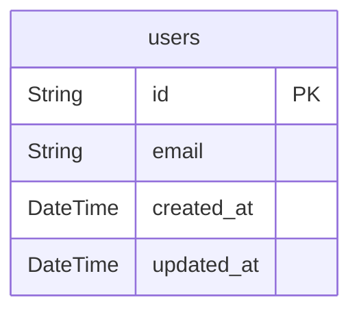

# Database Schema

> Generated by [`prisma-markdown`](https://github.com/samchon/prisma-markdown)

- [User](#user)
- [Overview](#overview)

## User

### `users`

ユーザー

Properties as follows:

- `id`:
- `email`:
- `created_at`:
- `updated_at`:

## Overview

### `users`

ユーザー

Properties as follows:

- `id`:
- `email`:
- `created_at`:
- `updated_at`:
